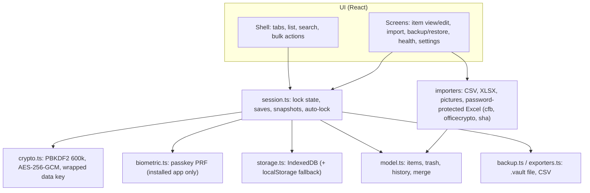

# Vault: developer notes

Offline, encrypted password vault. One HTML file for the phone, or an installable web app.
Nothing is ever sent over the network (single-file CSP: `connect-src 'none'`).

## Build and test

Source lives in `app/`. Run everything from there.

```sh
cd app
npm install
npm run build        # app/dist-single/index.html (one file) + app/dist-pwa/ (installable app)
npm run release      # build, then copy both to the repo root (index.html, assets/, sw.js…, password-vault.html)
npm test             # unit tests (vitest)
npm run typecheck
npx playwright test  # real-browser tests at 412x915 (phone size)
SHOTS=1 npx playwright test tests/e2e/zz-shots.spec.ts   # screenshot tour -> shots/tour
```

Fixtures: `python3 app/tests/fixtures/make_fixtures.py` and `make_hostile.py`
(need openpyxl, pillow, msoffcrypto-tool, cryptography; `lo_encrypt.py` needs LibreOffice).

## How it fits together



## Hosting the installable version

The repo root is the built app (after `npm run release`). Drag the root files onto Netlify Drop (or any static https host). `_headers` sets a
strict CSP. Open the address in Chrome on the phone, then "Install app". Fingerprint unlock works
only there, because passkeys need an https address. The hosted app keeps its own storage: move
your vault across with Settings > Back up now, then Restore in the installed app.
