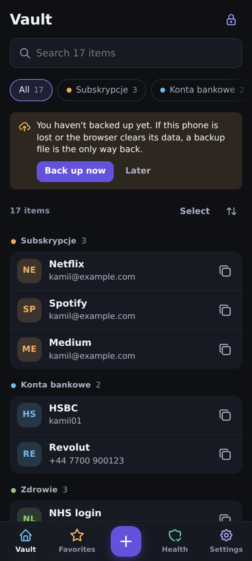
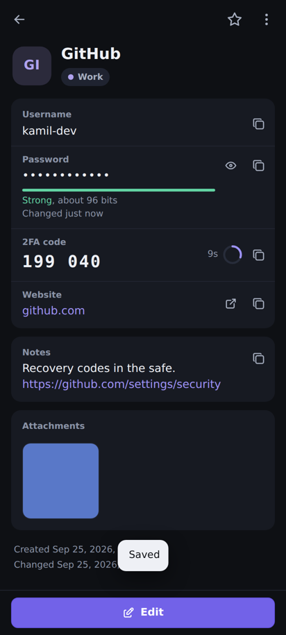
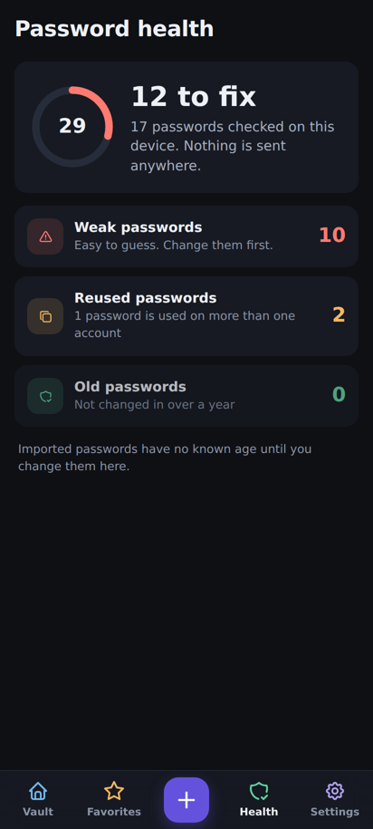
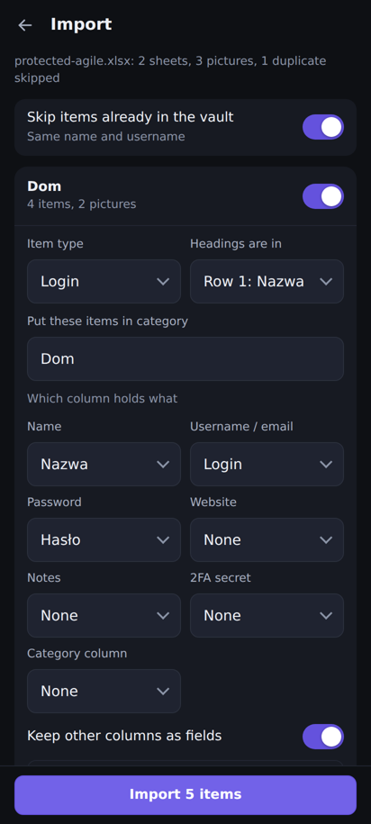
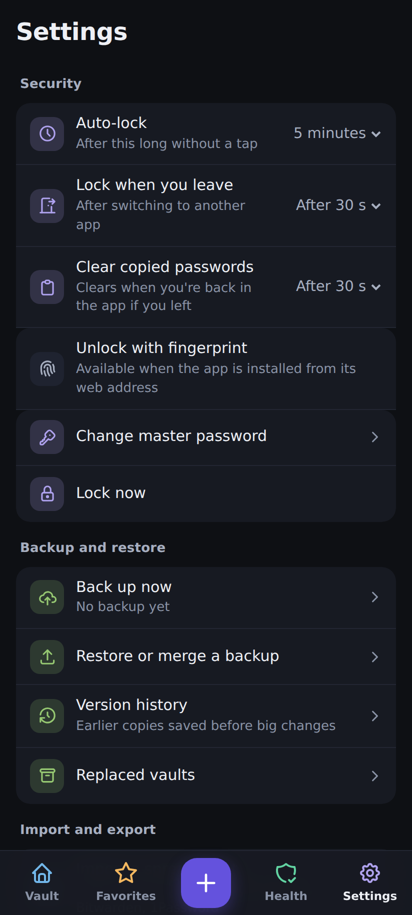
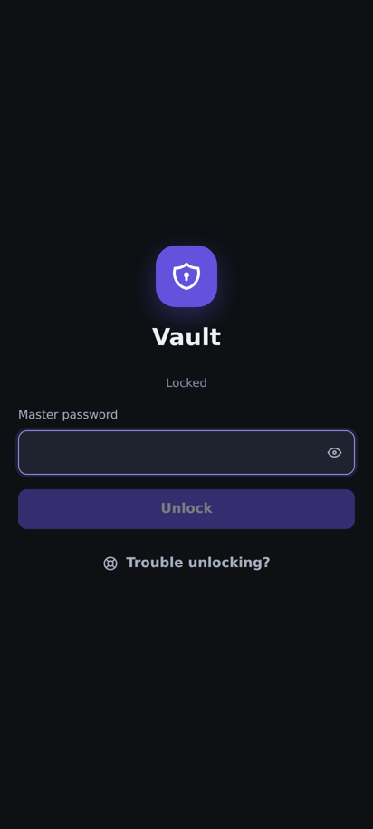

# 🔐 Vault

**All your passwords in one safe place on your phone.**

Logins, bank details, cards, IDs and notes, each with photos if you want. Everything is
locked with one master password and **never leaves your phone**. No account, no cloud,
no internet needed.

---

## 📱 What it looks like

| Your vault | An item | Health check |
| --- | --- | --- |
|  |  |  |

| Import a spreadsheet | Settings | Locked |
| --- | --- | --- |
|  |  |  |

---

## 🚀 How to run it

**The easy way (one file):**
Download **[`password-vault.html`](https://github.com/miekuskamil/vault/raw/main/password-vault.html)**
and open it in Chrome. That's it: one file with everything inside. Keep using the same file from
the same place and your vault stays there.

**The proper way (install it like a real app, with fingerprint unlock):**

1. Put this folder online for free: [Netlify Drop](https://app.netlify.com/drop) (drag the files in),
   or connect this repo on Netlify / GitHub Pages. No build step, the root is the app.
2. Open the web link in Chrome on the phone.
3. Menu (⋮) → **Install app**.
4. Settings → **Unlock with fingerprint**.

> The installed app keeps its own storage. Move your vault over with
> **Settings → Back up now**, then **Restore** in the installed app.

---

## ✨ What it does

- 🔑 **Logins, bank, cards, IDs, notes**, plus any extra fields you want (PIN, sort code…).
- 📷 **Photos and PDFs** on any item, shrunk and encrypted like everything else.
- 📊 **Import your spreadsheet**: Excel (even **password-protected**), CSV, or exports from
  Chrome, Bitwarden, 1Password, Firefox. Every tab becomes a category, pictures stay with their row.
- 🔢 **2FA codes** built in, like an authenticator app.
- 🩺 **Health check**: weak, reused and old passwords.
- 🎲 **Password generator**: random characters or easy-to-type words.
- ⭐ Favorites, search, categories, select many to move or delete at once.
- 🗑️ **Trash** for 30 days, **undo**, version history, earlier passwords kept per item.
- 🌙 Dark or light theme.

---

## 🛡️ Is it safe?

- Your master password makes the key (PBKDF2-SHA256, 600,000 rounds). It's never stored.
- Everything is encrypted with **AES-256-GCM** on the phone before it's saved.
- The app **can't connect to the internet** at all (blocked by its own security policy).
- Locks itself after a few minutes, or when you switch apps. Copied passwords get cleared.
- ⚠️ There's **no password recovery**. Forget the master password and nobody can open it.
  Make a **backup file** (Settings → Back up now) and keep it somewhere else.

---

## 💾 Will my stuff stay saved?

Yes, in the browser's storage on your phone. It stays when you close the app, restart the phone
or update the app. It's gone if you **clear browsing data**, so back up now and then.

---

## 🛠️ For developers

How it's built, testing, and releasing are in **[DOCS.md](DOCS.md)**.
For a one-page tour (stack, architecture, build phases, tests), open
**[`docs/overview.html`](docs/overview.html)**.

---

## 📂 What's in this project

| File | What it is |
| --- | --- |
| `password-vault.html` | The whole app in **one file**. Download and open. |
| `index.html`, `assets/` | The installable web app (host this folder). |
| `sw.js` | Makes the installed app work with no internet. |
| `manifest.webmanifest`, `icons/` | App name and icon for the phone. |
| `_headers` | Strict security headers for Netlify. |
| `app/` | Source code (React + TypeScript) and tests. |
| `DOCS.md` | Developer notes. |
| `docs/overview.html` | One-page project overview. |
