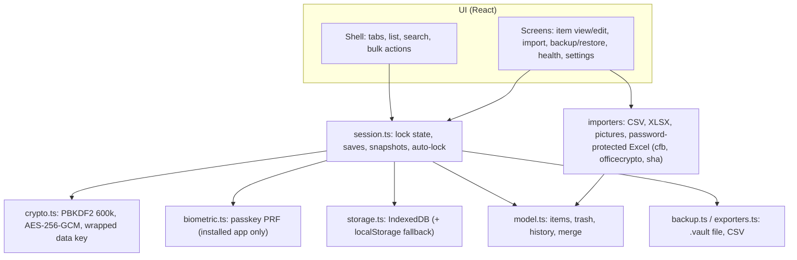

# Vault 2.0

Offline, encrypted password vault. One HTML file for the phone, or an installable web app.
Nothing is ever sent over the network (single-file CSP: `connect-src 'none'`).

## Download and run

Download [`password-vault.html`](https://github.com/miekuskamil/vault/raw/main/password-vault.html) and open it in Chrome.
Nothing to install; everything runs and stays on the device. After a code change, run `npm run build:single`
and copy `dist-single/index.html` over `password-vault.html`.

## Build and test

```sh
npm install
npm run build        # dist-single/index.html (one file) + dist-pwa/ (installable app)
npm test             # unit tests (vitest)
npm run typecheck
npx playwright test  # real-browser tests at 412x915 (phone size)
SHOTS=1 npx playwright test tests/e2e/zz-shots.spec.ts   # screenshot tour -> shots/tour
```

Fixtures: `python3 tests/fixtures/make_fixtures.py` and `make_hostile.py`
(need openpyxl, pillow, msoffcrypto-tool, cryptography; `lo_encrypt.py` needs LibreOffice).

## How it fits together



## Hosting the installable version

Drag the contents of `dist-pwa/` onto Netlify Drop (or any static https host). `_headers` sets a
strict CSP. Open the address in Chrome on the phone, then "Install app". Fingerprint unlock works
only there, because passkeys need an https address. The hosted app keeps its own storage: move
your vault across with Settings > Back up now, then Restore in the installed app.
